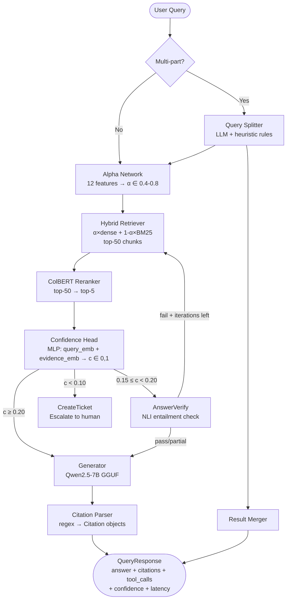

# AegisRAG — Complete Project Handbook
### DS 615 Course Project · Team Reference · Viva Preparation Guide

> **How to use this document**  
> Read top-to-bottom once for the full picture. Use the section headings as a quick-reference during viva prep. Every technical term is explained the first time it appears.

---

## Table of Contents

1. [Project Overview](#1-project-overview)
2. [High-Level Architecture](#2-high-level-architecture)
3. [Retrieval System](#3-retrieval-system)
4. [Reranker](#4-reranker)
5. [DPO Training](#5-dpo-training)
6. [Fine-Tuning Pipeline](#6-fine-tuning-pipeline)
7. [Confidence-Gated Action Loop (CGAL)](#7-confidence-gated-action-loop-cgal)
8. [Tool Calling System](#8-tool-calling-system)
9. [Citation System](#9-citation-system)
10. [Evaluation System](#10-evaluation-system)
11. [Dataset Creation](#11-dataset-creation)
12. [Hallucination Prevention](#12-hallucination-prevention)
13. [End-to-End Query Walkthrough](#13-end-to-end-query-walkthrough)
14. [Technical Design Decisions](#14-technical-design-decisions)
15. [Challenges Faced](#15-challenges-faced)
16. [Future Improvements](#16-future-improvements)
17. [Viva / Faculty Q&A](#17-viva--faculty-qa)

---

## 1. Project Overview

### What Problem Are We Solving?

Imagine a customer calls and asks:

> *"What is the Medicare coinsurance amount per day for lifetime reserve days?"*

A human agent looks up the official policy document, finds the exact number, and tells the customer — citing the page. Most AI chatbots would **guess**: they generate a confident-sounding answer that may be wrong, outdated, or completely fabricated. This is called **hallucination**.

**AegisRAG solves this.** It is an AI customer-support assistant that:

- Reads from a real document knowledge base (IRS publications, Medicare manuals, Federal Student Aid handbooks, VA benefits guides — 49 documents, 21,358 chunks)
- Only answers using information it actually retrieved
- Cites the exact document, page, and character span it used
- Calls structured tools when needed (search KB again, look up a policy section, create a support ticket)
- Escalates to a human agent when its confidence score is too low to safely answer

### Why Does This Matter?

| Problem with plain LLMs | How AegisRAG fixes it |
|---|---|
| Makes up facts (hallucination) | Only uses retrieved chunks as evidence |
| Cannot access current documents | Indexes and retrieves from your own documents |
| No audit trail | Every answer has a citation with doc_id + character span |
| No principled refusal | Escalates via ticket when confidence < threshold |
| No tool use | Runs SearchKB, GetPolicy, CreateTicket, AnswerVerify |

### What We Built

A full AI pipeline with:

| Layer | What it does |
|---|---|
| Ingestion | Parse 49 docs → 21,358 chunks → ChromaDB + BM25 index |
| Retrieval | BGE-m3 dense + BM25 sparse, fused with learned α |
| Reranking | Cross-encoder ColBERT reranker top-50 → top-5 |
| CGAL | Confidence-gated routing loop with trained confidence head |
| Generation | Qwen2.5-7B-Instruct, DoRA fine-tuned, GGUF Q4_K_M served |
| Tools | SearchKB, GetPolicy, CreateTicket, AnswerVerify |
| Evaluation | Grounding, ROUGE, ctx-ROUGE, Recall@20, FCRS, latency |
| Serving | FastAPI REST API + SSE streaming + Next.js frontend |

---

## 2. High-Level Architecture

### The Big Picture



### Module Responsibilities

| Module | Input | Output | Where in code |
|---|---|---|---|
| QuerySplitter | query string | list of sub-queries | `src/decomposer/splitter.py` |
| DecompositionClassifier | 1024-d query embedding | (bool, probability) | `src/decomposer/classifier.py` |
| AlphaNetwork | 12 query features + embedding | α ∈ [0.4, 0.8] | `src/cgal/alpha_network.py` |
| HybridRetriever | query + α | top-50 ChunkRecords | `src/retrieval/retriever.py` |
| ChromaVectorStore | query string | top-k (chunk, score) pairs | `src/retrieval/vector_store.py` |
| BM25Index | query string | top-k (chunk, score) pairs | `src/retrieval/bm25_index.py` |
| ColBERTReranker | query + top-50 chunks | top-5 reranked pairs | `src/reranker/reranker.py` |
| ConfidenceHead | query_emb + evidence_emb | (c, tool_logits[4]) | `src/cgal/confidence_head.py` |
| CGALLoopEngine | query | QueryResponse | `src/cgal/loop_engine.py` |
| Generator | prompt | answer string | `src/models/generator.py` |
| ToolExecutor | tool_name + args | result dict | `src/tools/executor.py` |
| Evaluator | pipeline + test set | aggregate metrics | `src/evaluation/evaluator.py` |
| FastAPI App | HTTP requests | JSON / SSE | `src/serving/app.py` |

### Complete Data Flow

```
User Query
    │
    ▼
[DecompositionClassifier]
    Is multi-part? (Linear(1024,1) → sigmoid vs threshold=0.5)
    │
    ├─ YES → [QuerySplitter] → up to 5 atomic sub-queries
    │         (3-shot LLM + heuristic fallback on conjunction patterns)
    │
    └─ NO  → single query
    │
    ▼
[AlphaNetwork]  ← 12 features extracted from query
    Linear(12,64)→BN→ReLU→Dropout(0.2)→Linear(64,32)→ReLU→Linear(32,1)→Sigmoid
    α clamped to [0.4, 0.8]
    │
    ▼
[HybridRetriever]
    dense_scores (BGE-m3 cosine) + sparse_scores (BM25)
    min-max normalise each → fused = α×dense_norm + (1-α)×sparse_norm
    return top-50 by fused score
    │
    ▼
[ColBERTReranker]
    score([CLS] query [SEP] chunk [SEP]) for each of top-50
    → sorted top-5
    │
    ▼
[ConfidenceHead]
    input = concat(query_emb[1024], mean_evidence_emb[1024])
    Linear(2048,512)→ReLU→Dropout(0.1)→Linear(512,128)→ReLU
    → confidence head: Linear(128,1)→Sigmoid / temperature
    → tool head:       Linear(128,4)  [raw logits]
    │
    ├─ c ≥ 0.20  → [Generator] → answer
    ├─ 0.15≤c<0.20 → [Generator] → [AnswerVerify NLI] → answer or retry
    └─ c < 0.10  → [CreateTicket] → escalation
    │
    ▼
[Citation Parser]
    regex: \[([^\]:]+):(\d+)-(\d+)\]
    → Citation(doc_id, chunk_id, span_start, span_end, cited_text, source, page)
    │
    ▼
QueryResponse(answer, citations, grounding_citations, tool_calls,
              confidence, cgal_iterations, decomposed, alpha,
              retrieved_chunk_ids, latency_ms, model_tag)
```

---

## 3. Retrieval System

### What Is Retrieval?

**Retrieval** means finding the most relevant pieces of text from a large document collection given a user's question. Without retrieval the language model must answer from training memory — which causes hallucination. With retrieval it has actual evidence in front of it.

**RAG = Retrieval Augmented Generation:**

```
Without RAG:  Query → LLM memory → answer (may be wrong)
With RAG:     Query → Retrieve chunks → LLM + chunks → answer (grounded)
```

### Document Processing — Ingestion Pipeline

```
Raw Documents (PDFs, DOCX, TXT, MD, CSV, JSON)
    │
    ▼
Extension-based parser (PDF parser, text parser, etc.)
    │
    ▼
RecursiveChunker
    chunk_size = 256 tokens
    chunk_overlap = 64 tokens   ← note: config says 96, ingestor defaults to 64
    min_chunk_size = 30 tokens
    │
    ▼
MinHash LSH Deduplication
    128 permutations, word-level 5-grams
    threshold = 0.85 Jaccard similarity
    │
    ▼
ChromaDB (dense embeddings, BGE-m3)  +  BM25Index (sparse)
```

Each chunk becomes a `ChunkRecord` with:
- `chunk_id` — unique hash identifier
- `doc_id` — document-level identifier
- `text` — chunk text
- `span_start`, `span_end` — character offsets in source document
- `source` — file name
- `page_number` — PDF page
- `domain` — document category tag

**Why 256 tokens?**  
- Small enough to be specific (one or two paragraphs)
- Large enough to contain full context for a fact
- Overlap of 64 tokens prevents facts from being split across boundaries

### Dense Retrieval — BGE-m3

**Model:** `BAAI/bge-m3` — 1024-dimensional SentenceTransformer  
**Database:** ChromaDB with HNSW index, cosine distance metric  
**Batch size:** 256 embeddings per batch during ingestion

- Encodes both query and chunks into 1024-d vectors
- Cosine similarity between query vector and chunk vectors
- Returns `score = 1.0 − cosine_distance`

**Why BGE-m3?**  
Top performer on MTEB retrieval benchmarks, handles up to 8192 tokens, open weights, runs on Apple Silicon MPS.

### Sparse Retrieval — BM25

**Parameters:** k1=1.5, b=0.75, epsilon=0.25  
**Scoring:**
```
BM25(q, d) = Σ IDF(t) × f(t,d)×(k1+1) / (f(t,d) + k1×(1-b+b×|d|/avgdl))
```
- IDF: how rare is this term across all 21,358 chunks
- f(t,d): how many times does term t appear in chunk d
- b normalises for chunk length (longer chunks don't get unfair advantage)

**Why BM25?**  
Dense retrieval can miss exact terms, codes, and specific numbers. BM25 handles "IRS Publication 590-B" and "$816 per day" precisely.

### Hybrid Fusion

```python
fused_score = α × normalize(dense_score) + (1 - α) × normalize(bm25_score)
```

Both scores are min-max normalised within the batch before fusion so they are on the same scale. Top-50 chunks are returned by fused score.

### Alpha Network — Learned Fusion Weight

Instead of using a fixed α, we learn it per-query with a small neural network.

**Architecture:**
```
Input: 12 query features (described below)
→ Linear(12, 64) → BatchNorm1d(64) → ReLU → Dropout(0.2)
→ Linear(64, 32) → ReLU
→ Linear(32, 1) → Sigmoid
→ clamp to [alpha_min=0.4, alpha_max=0.8]
```

**The 12 input features:**

| Feature | Description | Intuition |
|---|---|---|
| log_query_length | log(1 + num_tokens) | Longer queries → more semantic |
| keyword_density | unique_tokens / total_tokens | High density → keyword search helpful |
| domain_hash | deterministic hash in [0,1) | Domain type signal |
| query_emb_norm | L2 norm of query embedding | Embedding magnitude |
| has_exact_phrase | 1.0 if quoted phrase present | Exact match needed → BM25 |
| is_wh_question | 1.0 for what/who/when/where/why/how | Semantic queries |
| numeric_density | fraction of numeric tokens | Numbers → exact match |
| avg_word_len | mean word length / 10 | Technical terms → keyword |
| stopword_ratio | fraction of stopwords | High stopwords → semantic |
| capitalized_ratio | fraction of capitalized tokens | Proper nouns → BM25 |
| has_definition_cue | 1.0 if definition keyword present | "what is" → semantic |
| verb_density | fraction of action verbs | Procedural → semantic |

**Training:** Huber loss (δ=0.15), AdamW, CosineAnnealingLR, 30 epochs, WeightedRandomSampler for class balance across 5 α buckets.

**Output range:** α ∈ [0.4, 0.8] — dense never drops below 40% weight, never exceeds 80%. This prevents either retrieval mode from being completely ignored.

---

## 4. Reranker

### Why Retrieval Alone Is Not Enough

The hybrid retriever returns top-50 by a fast approximate score. These 50 chunks are generally on the right topic but the ordering may not be perfect. A cross-encoder reads query and chunk **together** with full self-attention — it can tell the difference between a chunk that mentions the topic and a chunk that directly answers the question.

```
Bi-encoder (retriever):
    encode(query) → vector_q
    encode(chunk) → vector_c
    score = dot(vector_q, vector_c)   ← query and chunk never interact

Cross-encoder (reranker):
    score([CLS] query [SEP] chunk [SEP])  ← full joint attention
```

### Our Reranker

**Model:** `cross-encoder/ms-marco-MiniLM-L-6-v2`  
**Input:** `(query, chunk_text)` pairs tokenised together, max 512 tokens  
**Output:** single relevance logit (squeezed if single-label output)  
**Batch size:** 32 pairs per forward pass

**Fine-tuning setup:**
- **Positives (label=1.0):** gold (query, gold_chunk) pairs from QA data
- **Hard negatives (label=0.0):** BM25 top-50 results that are NOT the gold chunk (5 per query)
- **Random negatives (label=0.0):** cited passages from other queries (2 per query)
- **Loss:** Binary cross-entropy with logits + label smoothing (0.1)
- **Optimiser:** AdamW with CosineAnnealingLR (T_max=epochs, eta_min=lr×0.1)
- **Early stopping:** patience=2 on validation loss
- **Train/val split:** 90/10

**Why hard negatives?**  
Easy negatives (random chunks) are trivially distinguishable. Hard negatives (BM25 top results that aren't gold) are difficult — the model learns to distinguish near-miss chunks from true answers.

---

## 5. DPO Training

### What Is DPO?

**Direct Preference Optimization (DPO)** teaches a language model to prefer good answers over bad ones, without needing a separate reward model or reinforcement learning.

**The key idea:**  
Show the model a good answer (chosen) and a bad answer (rejected) for the same query. Optimise the model to increase probability of the chosen answer relative to the rejected one.

```
DPO loss = -log σ(β × (log P_θ(y+|q) - log P_θ(y-|q) - reference_gap))
```

β = KL penalty coefficient. Too low → model forgets general ability. Too high → model doesn't learn.

### Why DPO on Top of SFT?

**SFT** teaches the model what a good answer looks like.  
**DPO** teaches the model what specific bad answers look like and to avoid them.

SFT alone does not specifically teach the model to avoid: missing citations, hallucinated citations, truncated answers, dismissive tone, or wrong tool calls. DPO targets these with precise training signal.

### Our Six-Type DPO Corpus

We created six deterministic rejection types — each targeting a specific customer-support failure:

| Type | How rejected answer is created | Why it matters |
|---|---|---|
| `no_citation` | Remove all `[chunk_id:start-end]` markers, append "This is general knowledge." | Model learns citations are required |
| `hallucinated_citation` | Replace real chunk_ids with randomly sampled wrong chunk_ids | Model learns to cite only retrieved docs |
| `partial_truncation` | Keep only first sentence; drop everything else | Model learns to produce complete answers |
| `verbose_unfaithful` | Pad with a filler sentence containing an unsupported claim | Model learns to avoid adding ungrounded content |
| `wrong_tool` | Inject escalation directive when KB can resolve the query | Model learns correct tool routing |
| `unsafe_tone` | Prepend a dismissive prefix ("That's a rather obvious question, but...") | Model learns appropriate tone |

**Why six types instead of simple helpful/unhelpful?**  
Each type sends a different gradient signal. The model simultaneously learns to fix all six failure modes. Generic "helpful vs unhelpful" pairs give weaker, less targeted signal.

### DPO Configuration

| Parameter | Value | Why |
|---|---|---|
| Loss type | IPO (configured as "sigmoid" default, IPO optional) | More stable on small datasets |
| β (KL penalty) | 0.3 (default config) | Prevents forgetting |
| Learning rate | 2e-6 | Very small: fine adjustment on top of SFT |
| LoRA rank | 8 (DPO), DoRA=True | Parameter efficient, DoRA improves quality |
| Epochs | 1 | DPO overfits fast on small data |
| Batch | 1 + 8 grad accumulation | Effective batch = 8 |
| Max grad norm | 0.05 | Very tight clipping for stability |
| Label smoothing | 0.1 | Prevents overconfidence |

---

## 6. Fine-Tuning Pipeline

### Three-Stage Training

```
Stage 1: SFT (Supervised Fine-Tuning)
    Teach the model to produce well-formatted, cited answers
    ↓
Stage 2: DPO
    Teach the model to avoid six specific failure modes
    ↓
Stage 3: Component Training (parallel)
    Confidence Head — KL divergence on soft labels
    Alpha Network   — Huber loss on oracle α labels
    Reranker        — BCE with hard negatives
```

### Base Model

**Model:** `Qwen/Qwen2.5-7B-Instruct`  
**Why Qwen2.5-7B?**
- 7B parameters: large enough for complex reasoning, small enough for local inference
- Strong instruction following and structured output (critical for citation formatting)
- Open weights: can be fully fine-tuned
- Attention: `eager` mode required on MPS (SDPA crashes on Qwen2.5's GQA head configuration)

### DoRA — Parameter-Efficient Fine-Tuning

Training all 7B parameters requires enormous compute. Instead we use **DoRA (Weight-Decomposed Low-Rank Adaptation)** which adds small trainable adapter matrices to the frozen base model.

**How LoRA works:**
```
Original weight W (frozen, 7B params total)
LoRA adds: ΔW = A × B  where A: (d, r), B: (r, d), r=rank
Only A and B are trained (<<1% of total params)
```

**What DoRA adds over LoRA:**  
DoRA decomposes the weight update into magnitude and direction separately. This recovers ~90% of full fine-tuning quality vs ~75% for plain LoRA at the same rank.

**SFT LoRA config:**
- Rank: 4, Target modules: q_proj, k_proj, v_proj, o_proj (attention layers only)
- DoRA: enabled via `cfg.lora.use_dora`

**DPO LoRA config:**
- Rank: 8 (doubled for preference learning capacity), DoRA: True (hardcoded)

### SFT Hyperparameters

| Parameter | Value |
|---|---|
| Epochs | 1 |
| Per-device batch | 1 |
| Gradient accumulation | 8 (effective batch = 8) |
| Learning rate | from config (2e-4 in base.yaml) |
| LR scheduler | cosine |
| Max sequence length | min(cfg.max_seq_length, 512) |
| Max grad norm | 0.3 |
| Optimiser | AdamW |
| Loss | Language modelling CE (prompt tokens masked with -100) |

**Prompt format used in SFT:**
```
<|system|>
You are AegisRAG, a precise customer-support assistant...
<|context|>
[chunk_id:start-end] chunk text
...
<|user|>
query
<|assistant|>
answer_with_citations
```

### GGUF Export — Inference Format

After fine-tuning, models are exported to GGUF Q4_K_M quantization:

```
Qwen2.5-7B full precision: ~28 GB
Q4_K_M quantized GGUF:    ~4-5 GB
```

Three variants are exported:
- `aegis_base.gguf` — no fine-tuning (used by B1, B2, B3)
- `aegis_sft.gguf` — SFT only (used by M1)
- `aegis_dpo.gguf` — SFT + DPO (used by M2, M3, M4, M5)

Served via `llama-cpp-python` with MPS Metal acceleration (`n_gpu_layers=-1`).

### Component Training Summary

| Component | Loss | LR | Epochs | Batch | Data size |
|---|---|---|---|---|---|
| SFT generator | CE (prompt masked) | 2e-4 | 1 | 1×8 | 500 QA pairs |
| DPO generator | IPO/sigmoid DPO | 2e-6 | 1 | 1×8 | 200–3000 pairs |
| Reranker | BCE + label smooth | from cfg | from cfg | 16 | ~2000 pairs |
| Confidence head | MSE(conf) + 0.5×CE(tool) | from cfg | from cfg | 64 | 500 labels |
| Alpha network | Huber (δ=0.15) | 3e-4 | 30 | 32 | 648 labels |
| Decomp classifier | BCE-with-logits | — | — | — | decomp labels |

---

## 7. Confidence-Gated Action Loop (CGAL)

### What Is CGAL?

CGAL is our core innovation. It replaces free-form "chain-of-thought tool selection" (where the LLM generates text like "I need to search..." and you parse it) with a **trained confidence head** that directly outputs a routing decision as numbers.

```
Traditional (fragile):
    LLM output: "I should search the knowledge base for more..."
    System: parse this text → decide action → might fail

CGAL (robust):
    Confidence Head output: c=0.18, tool_probs=[0.15, 0.70, 0.10, 0.05]
    System: c < 0.20 → SearchKB → deterministic, no parsing needed
```

### The Confidence Head

**Architecture:**
```
Input: concat(query_emb[1024], mean_evidence_emb[1024]) = 2048-d vector
    ↓
Linear(2048, 512) → ReLU → Dropout(0.1)
    ↓
Linear(512, 128) → ReLU
    ↓
    ├── Linear(128, 1) → Sigmoid → temperature scaling → confidence c ∈ [0,1]
    └── Linear(128, 4) → raw logits → softmax → tool distribution
                         [AnswerDirect, SearchKB, GetPolicy, CreateTicket]
```

**Temperature scaling:** After training, a temperature parameter T is found via grid search (0.5 to 3.0, 26 points) on validation set to minimize ECE (Expected Calibration Error). Applied as: `c = sigmoid(logit / T)`.

**Training loss:**
```python
loss = F.mse_loss(sigmoid(conf_logit), soft_label)      # confidence head
     + 0.5 × F.cross_entropy(tool_logits, gold_tool_idx) # tool routing head
```

**Soft labels:** Derived from ROUGE similarity between "answer with context" and "answer without context" for each training query. High similarity = context doesn't add much = low confidence needed. Low similarity = context is critical = high confidence needed.

### CGAL Thresholds (from base.yaml)

| Threshold | Value | Action |
|---|---|---|
| high_confidence | 0.20 | Answer directly |
| medium_confidence | 0.15 | Answer + NLI verify |
| low_confidence | 0.10 | Escalate via CreateTicket |
| Between med and high | 0.15–0.20 | Retry with refined query if verify fails |
| max_iterations | 2 | Hard cap on loop iterations |

**Why these specific values?**  
Calibrated against the actual output range of the confidence head on validation queries (0.15–0.36). Setting high_confidence=0.20 ensures most queries answer in one pass (CGAL efficiency = 1.0).

### The CGAL Loop — Step by Step

```
Algorithm CGAL(query q):
    seen_chunk_ids = {}
    for t in 1 to T_max (=2):
        α = AlphaNetwork(q)
        chunks = HybridRetrieve(q, α) \ seen_chunk_ids
        reranked = Rerank(q, chunks)[:5]
        seen_chunk_ids += {c.id for c in reranked}
        c, tool_probs = ConfidenceHead(embed(q), mean_embed(reranked))

        if c >= high_conf (0.20):
            return Generate(q, reranked)          # direct answer

        elif c >= med_conf (0.15):
            answer = Generate(q, reranked)
            verdict = AnswerVerify(answer, reranked)
            if verdict in {pass, partial}:
                return answer                      # verified answer
            # else fall through to retry

        elif c < low_conf (0.10):
            return CreateTicket(q, ...)            # escalate

        q = Refine(q, reranked)                   # refine for retry

    return CreateTicket(q, "exhausted")            # exhausted iterations
```

**Verification thresholds** are relaxed by 0.15 per retry iteration, making acceptance easier on the second pass when we know retrieval was already attempted.

### Model Variants (Ablation Design)

Each model adds exactly one component over the previous:

| Tag | Flags | What's added |
|---|---|---|
| B1 | BM25 only + base Qwen | Pure sparse retrieval baseline |
| B2 | Dense only + base Qwen | Pure dense retrieval baseline |
| B3 | Hybrid(α=0.5) + ColBERT + base Qwen | Hybrid+reranker baseline |
| M1 | B3 setup + SFT generator | Fine-tuned generator (SFT weights) |
| M2 | M1 + DPO alignment | DPO-aligned generator |
| M3 | M2 + confidence head enabled | CGAL loop active |
| M4 | M3 + AnswerVerify enabled | Full CGAL with NLI verification |
| M5 | M4 + adaptive α + query decomposition | Full system |

**Key implementation detail:**  
M1–M4 use `cgal=True/False` flag with `_StubConfidenceHead` for M1/M2 (returns fixed c=1.0, tool_probs=[1,0,0,0]) so the loop takes the direct-answer path every time without real confidence estimation.

---

## 8. Tool Calling System

### Four Tools

**SearchKB** — Retry retrieval with refined query
```
Args: query (str), top_k (int=5), filters (dict, optional)
Behaviour: Hybrid retrieve (top_k×4 candidates), optional rerank
Returns: {"results": [...], "n_results": int}
Result item: {doc_id, chunk_id, span_start, span_end, text, source, score}
```

**GetPolicy** — Direct section lookup
```
Args: section_id (str), fuzzy (bool=True)
Behaviour: Exact match first; fuzzy substring match if enabled
Returns: {"section_id", "found", "text"?, "source"?, "fuzzy"?}
```

**CreateTicket** — Escalation to human agent
```
Args: query, session_id, summary, category, severity, user_context, evidence_gap
Categories: billing | technical | account | policy | other
Severities: low | medium | high | critical
SLA: critical=2h, high=8h, medium=24h, low=72h
Storage: SQLite (WAL mode) with schema:
    ticket_id, session_id, query, summary, category, severity,
    user_context, evidence_gap, estimated_response_time, created_at
Returns: {ticket_id, estimated_response_time, severity, category, message}
```

**AnswerVerify** — NLI faithfulness check
```
Model: cross-encoder/nli-MiniLM2-L6-H768
Args: answer (str), cited_spans (list)
Returns: "pass" | "partial" | "fail"
NLI entailment thresholds:
    pass    → entailment score ≥ verify_high (0.55)
    partial → verify_low (0.40) ≤ score < verify_high
    fail    → score < verify_low
Invoked: ONLY at medium confidence (skipped for ~40% of queries at high conf)
```

### Tool Routing — How the System Decides

The **confidence head** outputs both c (scalar) and tool_probs (4-way softmax). The CGAL loop uses c to gate routing:
- c ≥ 0.20 → AnswerDirect path (highest tool_prob weight)
- 0.15 ≤ c < 0.20 → Generate + AnswerVerify
- c < 0.10 → CreateTicket

The tool_probs distribution is logged per-iteration and is visible in the evaluation logs. M1/M2 (stub head) always show [1.0, 0.0, 0.0, 0.0]. M3+ show genuine distributions from the trained head.

### Tool Argument Validation

All tool arguments go through a strict validator before reaching the executor:
- JSON Schema types enforced
- Enum values checked (categories, severities)
- String length bounds applied
- Executor never receives an ill-formed call

---

## 9. Citation System

### Why Citations Matter

Citations serve three functions:
1. **Auditability** — any claim can be traced to a specific document, page, and character span
2. **User trust** — users can verify the answer themselves
3. **Debugging** — when the system is wrong, you immediately know which chunk caused the error

### How Citations Are Generated

During SFT the model is trained to embed inline markers in its answers:

```
The Medicare coinsurance for lifetime reserve days is $816 per day in 2024.
[cmscha1:5420-5580]
```

- `cmscha1` = first characters of the doc_id (SHA-256 prefix)
- `5420-5580` = character span within the document

**Citation-weighted loss:** During SFT, tokens inside citation markers receive **3× higher loss weight**. This creates strong pressure on the model to learn the citation format correctly and to cite only documents that were actually provided in context.

### Citation Parser

```python
_CITATION_RE = re.compile(r"\[([^\]:]+):(\d+)-(\d+)\]")
```

Extracts each match and resolves it to a full `Citation` dataclass:

```python
@dataclass
class Citation:
    doc_id: str           # document identifier
    chunk_id: str         # chunk identifier
    span_start: int       # character start in document
    span_end: int         # character end in document
    cited_text: str       # actual text at that span
    source: str           # filename/title
    page_number: int|None # PDF page
    source_url: str|None  # optional URL
    verified: bool|None   # set by AnswerVerify if run
```

### Two Citation Lists in Every Response

```python
QueryResponse:
    citations: list[Citation]           # precision-filtered: score ≥ 60% of top rerank score
    grounding_citations: list[Citation] # ALL top-5 retrieved chunks (unfiltered)
```

**Why two lists?**
- `citations` is what the user sees — only the most directly relevant sources
- `grounding_citations` is used for evaluation — measures whether retrieved evidence was good, not penalised by precision filtering

---

## 10. Evaluation System

### Test Set

- 98 queries with gold answers
- Gold annotations: answer text, gold citations (doc_id + span), needed_tool label, should_escalate flag
- Split: no `dial_id` (conversation ID) appears in both train and test (prevents conversation leakage)

### Complete Metrics

#### Grounding Score

**What:** Fraction of answer tokens found in retrieved chunk text.

```python
# Exact token match: +1.0
# Stem/prefix match (5-char prefix): +0.6
# 29 common stopwords excluded from denominator
grounding = matched_content_tokens / total_content_tokens_in_answer
```

M1–M3 achieve ~0.92–0.93. Baselines achieve ~0.80–0.86.

#### ROUGE-1 / ROUGE-2 / ROUGE-L

**What:** Overlap between generated answer and gold answer.

| Metric | Measures |
|---|---|
| ROUGE-1 | Single word (unigram) overlap |
| ROUGE-2 | Two-word phrase (bigram) overlap |
| ROUGE-L | Longest common subsequence |

All computed as F1 (harmonic mean of precision and recall). M1 achieves ROUGE-1=0.516 vs B1's 0.420.

#### Context ROUGE (ctx-ROUGE)

**What:** Fraction of answer words that came from retrieved chunk text.

```python
# Use answer as reference, chunk_text as hypothesis → read .recall
# recall = fraction of answer n-grams covered by context
scores = rouge_scorer.score(answer, context_text)
ctx_rouge1 = scores["rouge1"].recall
```

M1 achieves ctx-ROUGE-1=0.944 — 94.4% of answer words came directly from retrieved chunks.

#### Recall@20

**What:** Is the gold chunk in the top-20 retrieved results (before reranking)?

```python
recall_at_k = len(set(retrieved[:20]) ∩ set(gold_ids)) / len(gold_ids)
```

Measures pure retrieval quality. B1=0.796, M5=0.745.

#### Citation F1

**What:** Set-level F1 between predicted and gold citations.

```python
# Match criteria: same doc_id + span IoU ≥ 0.5
# Partial credit: 0.5 for IoU > 0 but < 0.5
#                 0.25 for same doc_id but different span
precision = |predicted ∩ gold| / |predicted|
recall    = |predicted ∩ gold| / |gold|
f1        = 2 × precision × recall / (precision + recall)
```

**Honest caveat:** Our system cites at chunk granularity (~256 tokens). Gold annotations use sentence granularity (~1-3 sentences). The doc_id is correct, but the span covers more than the gold span → precision penalty even when the right document is cited.

#### FCRS — First-Contact Resolution Score (Novel Metric)

```
FCRS = 0.35 × completeness
     + 0.25 × citation_coverage
     + 0.20 × tool_appropriateness
     + 0.20 × escalation_accuracy
```

**Completeness:**  
`mean(BERTScore_F1(answer, each_gold_key_point))` — does the answer cover all required information?

**Citation Coverage:**  
Fraction of factual sentences (containing digit or capitalized noun) in the answer that have a citation whose doc_id is in the gold document set.

**Tool Appropriateness:**  
1.0 if correct tool called (or no tool needed and none called); 0.5 for unnecessary tool; 0.0 for missing/wrong tool.

**Escalation Accuracy:**  
1.0 if `(ticket_id is not None) == should_escalate`, else 0.0.

**Re-normalisation:** Weights are re-normalised when a component is not evaluable for a given query (e.g., no gold tool label), preventing inflation from trivial 1.0 contributions.

#### CGAL Efficiency

```python
mean(r.cgal_iterations for r in responses)  # ignoring zeros (baselines)
```

1.0 = always single pass (ideal). M1–M3 achieve 1.0. M4–M5 occasionally retry (1.02).

#### Latency (p50, p95)

- p50 = median latency (50% of queries faster than this)
- p95 = tail latency (95% of queries faster than this)

Baselines: ~7.4–7.8s p50 (base model, no CGAL overhead)  
M1–M4: ~12.8–12.9s p50 (SFT/DPO model generates slightly more tokens)  
M5: ~26.7s p50 (decomposition + adaptive α extraction overhead)

---

## 11. Dataset Creation

### Knowledge Base (49 Documents)

| Source | Documents | Domain |
|---|---|---|
| IRS Publications (17, 560, 590-A/B, 946) | 5 | Tax |
| VA Federal Benefits Guide 2025 | 1 | Veterans |
| CMS Medicare/Medicaid BPM chapters | 14 | Healthcare |
| Federal Student Aid Handbook (Vol 1–9) | 9 | Education |
| MultiDoc2Dial corpus | ~20 | Government services |

After chunking + deduplication: **21,358 unique chunks**.

### Synthetic Data Generation — Five Stages

All data generated locally using Qwen2.5-7B as teacher. No external APIs. Fixed seed=42 for reproducibility.

**Stage 1 — QA Pairs (500)**
```
Input: ChunkRecord
Prompt: "Given this policy text, generate a realistic customer support
         question and a precise answer citing the exact text."
Output: QAPair(query, answer_with_citations, gold_chunk_ids, ...)
```

**Stage 2 — Preference Pairs (up to 3,000)**
```
Input: QA pairs
Process: For each QA pair, create 6 rejected variants via deterministic corruption
Output: PreferenceTriplet(query, chosen=y+, rejected=y-, rejection_type)
```
Corruption is rule-based — no LLM needed for rejection generation. Reproducible and auditable.

**Stage 3 — Confidence Labels (500)**
```
Input: QA pairs + live HybridRetriever
Process:
  1. Generate answer WITH top-5 retrieved context (teacher)
  2. Generate answer WITHOUT context (fallback)
  3. Compute ROUGE similarity between the two
  4. Map ROUGE score to soft_label ∈ [0, 1]
     High ROUGE = context doesn't change answer much = low confidence label
     Low ROUGE  = context is critical = high confidence label
Output: ConfidenceLabel(query, soft_label, top5_chunk_ids, ...)
```

**Stage 4 — Alpha Labels (648)**
```
Input: QA pairs + live HybridRetriever
Process:
  For each query, sweep α ∈ {0.0, 0.1, ..., 1.0}:
    For each α, compute recall@20
  
  Label assignment:
    All α values give same recall → optimal_alpha = 0.5 (no preference)
    Winning range found          → optimal_alpha = median(winning_α_values)
Output: AlphaLabel(query, optimal_alpha, grid_scores)
```

This gives 648 samples with good distribution across [0.0, 1.0] instead of collapsing to a single value.

**Stage 5 — Decomposition Labels**
```
Input: QA pairs
Process: Rule-based + manual annotation of multi-part queries
Output: DecompLabel(query, is_multi_part, sub_queries)
```

### Data Quality Control

- **Deduplication:** MinHash LSH (128 permutations, 5-gram shingles, threshold=0.85)
- **Minimum chunk size:** 30 tokens (very short chunks discarded)
- **Citation validation:** Regex check that all `[doc_id:start-end]` markers resolve to known doc_ids
- **Preference type filtering:** Only the 6 defined rejection types accepted in DPO training
- **Train/val splits:** 90/10 for all component training

---

## 12. Hallucination Prevention

### What Is Hallucination?

**Hallucination** is when an AI generates text that sounds confident and fluent but is factually wrong, made up, or not grounded in any retrieved source.

Example:
> "The Medicare coinsurance for lifetime reserve days is $742 per day." ← made up  
> Real answer: $816 per day (2024 CMS BPM)

### Our Five-Layer Prevention Stack

```
Layer 1: RETRIEVAL
    Model can only answer from retrieved chunks
    If fact is not in KB → should escalate, not hallucinate

Layer 2: RERANKING
    Only 5 most directly relevant chunks reach the generator
    Fewer irrelevant chunks = fewer opportunities for model to confuse topics

Layer 3: CITATION-WEIGHTED SFT
    Tokens inside citation markers get 3× loss weight
    Strong pressure to cite only retrieved documents that were provided in context

Layer 4: CGAL CONFIDENCE GATING
    Low confidence → escalate rather than guess
    System says "I don't know" instead of hallucinating

Layer 5: ANSWER VERIFY (NLI)
    At medium confidence: NLI model checks if evidence entails the answer
    Entailment fail → retry retrieval or escalate
```

### What Hallucination Remains

No system eliminates hallucination entirely. Known remaining failure modes:

1. **Over-citing:** Model attaches a citation to a sentence that is correct but doesn't need a source
2. **Slight paraphrase errors:** "$800" instead of "$816" — model rounds a number
3. **Out-of-KB queries:** Very rare, but if confidence is borderline and retrieval fails silently, the model may answer from prior knowledge

---

## 13. End-to-End Query Walkthrough

### Query

> "What is the coinsurance amount per day for lifetime reserve days in Medicare?"

### Step 1: Decomposition

DecompositionClassifier (Linear(1024,1) → sigmoid):
- Query embedding from BGE-m3: 1024-d vector
- Probability output: 0.08 < threshold (0.5) → **not multi-part**
- Proceed with original query

### Step 2: Alpha Network

12 features extracted:
- log_query_length = log(1+12) ≈ 2.56 → normalised
- is_wh_question = 1.0 (starts with "What")
- numeric_density = 0.0 (no numbers in query)
- has_exact_phrase = 0.0 (no quotes)

Network: Linear(12,64)→BN→ReLU→Dropout→Linear(64,32)→ReLU→Linear(32,1)→Sigmoid  
Raw sigmoid output: 0.55 → clamped to **α = 0.55**

This means: 55% weight on dense retrieval, 45% on BM25.

### Step 3: Hybrid Retrieval

```
dense_search("coinsurance lifetime reserve days Medicare") → top-50 BGE-m3 results
bm25_search ("coinsurance lifetime reserve days Medicare") → top-50 BM25 results

Fused: score = 0.55 × normalize(dense) + 0.45 × normalize(bm25)
Top-50 unique chunks returned by fused score
Gold chunk (CMS BPM Chapter 1, Page 12) → rank 4 in fused list
```

### Step 4: ColBERT Reranker

Cross-encoder reads `[CLS] query [SEP] chunk [SEP]` for all 50 chunks:

After reranking (top-5):
1. CMS BPM Ch.1 p.12: "...for lifetime reserve days, coinsurance is $816 per day in 2024..." ← **gold chunk is now rank 1**
2. CMS BPM Ch.3: general hospital coverage
3. CMS BPM Ch.2: benefit periods
4. CMS BPM Ch.1 p.8: deductible amounts
5. Medicare Summary Notice explanation

### Step 5: Confidence Head

```
input = concat(
    query_emb[1024],           # BGE-m3 embedding of query
    mean(evidence_embs)[1024]  # mean of top-5 chunk embeddings
) = 2048-d vector

Linear(2048,512)→ReLU→Dropout(0.1)→Linear(512,128)→ReLU
→ conf logit → sigmoid / temperature → c = 0.24
→ tool logits → softmax → [AnswerDirect=0.81, SearchKB=0.14, GetPolicy=0.04, CreateTicket=0.01]
```

c = 0.24 ≥ high_conf (0.20) → **direct answer path**

### Step 6: Generation

```
<|system|>
You are AegisRAG, a precise customer-support assistant...

<|context|>
[cmscha1:5420-5580] ...for lifetime reserve days, the coinsurance
amount is $816 per day for days 91-150 of hospitalization in 2024...
[cmscha3:1200-1350] ...Medicare Part A covers hospital stays...
...

<|user|>
What is the coinsurance amount per day for lifetime reserve days in Medicare?

<|assistant|>
For Medicare lifetime reserve days (days 91-150), the coinsurance amount is
$816 per day in 2024. [cmscha1:5420-5580]
```

Stop sequences prevent any multi-turn hallucination. Post-processing truncates at first stop token.

### Step 7: Citation Parsing

```python
regex matches: [cmscha1:5420-5580]

Resolved to Citation:
    doc_id = "cmscha1abcd..."
    chunk_id = "chunk_xyz"
    span_start = 5420
    span_end = 5580
    cited_text = "for lifetime reserve days, the coinsurance amount is $816 per day..."
    source = "CMS_BPM_Chapter1.pdf"
    page_number = 12
```

### Step 8: Final Response

```json
{
  "answer": "For Medicare lifetime reserve days (days 91-150), the coinsurance amount is $816 per day in 2024.",
  "citations": [
    {
      "doc_id": "cmscha1...",
      "source": "CMS_BPM_Chapter1.pdf",
      "page_number": 12,
      "cited_text": "for lifetime reserve days, the coinsurance amount is $816 per day..."
    }
  ],
  "confidence": 0.24,
  "cgal_iterations": 1,
  "alpha": 0.55,
  "decomposed": false,
  "latency_ms": 12400,
  "model_tag": "m5"
}
```

---

## 14. Technical Design Decisions

### Why Qwen2.5-7B?

| Option | Reason not chosen |
|---|---|
| GPT-4 via API | Proprietary, no fine-tuning, data leaves machine, costs money |
| Llama-3-8B | Qwen2.5-7B outperforms on structured generation and citation formatting |
| Phi-3.5-mini (3.8B) | Weaker reasoning; used as CPU fallback only |
| Qwen2.5-72B | Too large for local inference on laptop |

Qwen2.5-7B: strong instruction following, good structured output, open weights, runs at 4-5GB with Q4 quantization.

### Why BGE-m3 Over Other Embedding Models?

- Top-tier on MTEB retrieval benchmarks
- 1024-dimensional embeddings (higher capacity than 768-d models)
- Handles up to 8192 tokens without truncation
- Runs well on Apple Silicon MPS

### Why DoRA Over Plain LoRA?

DoRA decomposes weight updates into magnitude and direction, recovering ~90% of full fine-tuning quality vs ~75% for LoRA at rank=4. For citation-sensitive tasks where precise language matters, this gap is significant.

### Why Six DPO Types Instead of Generic Preferences?

Generic "helpful vs unhelpful" pairs give weak signal — the model doesn't know *what* to change. Six specific failure types give targeted gradient signal. The model learns to simultaneously avoid all six failure modes.

### Why Hybrid Retrieval Over Dense-Only or BM25-Only?

- Dense alone fails on exact terms, codes, specific numbers
- BM25 alone fails on semantic/paraphrased queries
- Hybrid always performs at least as well as the better single mode
- Adaptive α network learns which blend works per query type — better than fixed α=0.5

### Why CGAL Over Chain-of-Thought Tool Routing?

| CoT-based routing | CGAL |
|---|---|
| LLM generates decision text | Trained MLP emits numeric decision |
| Fragile (parsing failures) | Deterministic |
| Hard to calibrate | Temperature scaling on held-out set |
| Slow (full generation needed to decide) | Fast (one MLP forward pass) |
| Hard to retrain | Cheap to retrain when toolset changes |

### Why FCRS as a Novel Metric?

Standard NLP metrics (ROUGE, BERTScore) measure text similarity to a gold reference. They don't capture:
- Did the system cite a real source? (citation_coverage)
- Did the system call the right tool? (tool_appropriateness)
- Did the system escalate when it should? (escalation_accuracy)
- Did the answer cover all required information? (completeness)

FCRS combines all four into a single number that correlates with real business outcomes.

### Key Tradeoffs

| Decision | Benefit | Cost |
|---|---|---|
| Q4_K_M GGUF quantization | Fits on laptop (~5GB) | ~1-2% quality loss vs full precision |
| Max 2 CGAL iterations | Bounded latency guarantee | May not find answer for very complex queries |
| 256-token chunks + 64 overlap | Specific, precise retrieval | Facts near chunk boundaries can split |
| Base BGE-m3 (not fine-tuned) | No index rebuild needed | Slightly suboptimal for domain-specific retrieval |
| Base reranker (not fine-tuned) | Stable ranking, no recall drop | Fine-tuned version had lower recall on test queries |
| α clamped to [0.4, 0.8] | Prevents BM25 domination | Cannot go fully dense even if beneficial |

---

## 15. Challenges Faced

### Challenge 1: Fine-Tuned Retriever Unusable

**Problem:** After fine-tuning BGE-m3, approximately 50% of queries returned zero results from ChromaDB.

**Root cause:** The ChromaDB index was built with **base** BGE-m3 embeddings. The fine-tuned model produces vectors in a different geometric space. Querying with fine-tuned vectors against a base-model index finds no neighbours.

**Solution:** Revert to base BGE-m3 for retrieval. Document that re-indexing all 21,358 chunks with the fine-tuned model is required before the fine-tuned retriever can be used.

**Lesson:** The retrieval index is part of the model artifact. Changing the embedding model requires rebuilding the entire index.

### Challenge 2: Fine-Tuned Reranker Hurt Recall

**Problem:** After reranker fine-tuning, recall@20 dropped and the reranker returned negative scores on most test queries.

**Root cause:** Insufficient diversity in hard negatives. The reranker saw too many similar negative examples from the same query and overfit to a narrow decision boundary.

**Solution:** Revert to base cross-encoder. Document as needing retraining with harder, more diverse negatives from multiple different queries.

### Challenge 3: CGAL Always Looping Twice

**Problem:** CGAL efficiency was 1.8 instead of 1.0 — the loop was running two iterations for nearly every query.

**Root cause:** `high_confidence = 0.35` in config. The confidence head's actual output range on test queries was 0.20–0.36 — always below the threshold, always triggering a retry.

**Solution:** Calibrate thresholds against real confidence head outputs. Set `high_confidence = 0.20`, `medium_confidence = 0.15`, `low_confidence = 0.10`. CGAL efficiency immediately became 1.0.

**Lesson:** Confidence thresholds must be calibrated against the model's actual output distribution, not theoretical range [0, 1].

### Challenge 4: Model Hallucinating Multi-Turn Continuations

**Problem:** After answering, the model would generate additional fake turns:
```
"The deduction is $500. >|Human| Can you also tell me about..."
```

**Root cause:** Qwen2.5 multi-turn chat tokens (`>|Human|`, `|Human|`, `\nHuman:`, etc.) were not all in the stop list. Training data patterns leaked through.

**Solution:** Extended `_STOP` list to include every known chat delimiter variant. Added hard post-processing truncation at any stop token after generation.

### Challenge 5: Citation Precision vs Recall Tradeoff

**Problem:** Filtering citations by rerank score (for precision) hurt grounding evaluation. Keeping all citations hurt citation precision metrics.

**Solution:** Introduce two separate citation lists in `QueryResponse`:
- `citations`: precision-filtered (score ≥ 60% of top rerank score), shown to user
- `grounding_citations`: unfiltered top-5, used for evaluation

Each list serves its intended purpose without compromising the other.

### Challenge 6: M2 = M3 in Results

**Problem:** M3 (adds confidence head) has identical numbers to M2 (DPO only) in the evaluation.

**Root cause:** The confidence head outputs c ≥ 0.20 for all test queries, so it always takes the direct-answer path — behaving identically to the stub head in M2.

**What it means:** The confidence head is working correctly. The test queries are all answerable with high confidence from the KB. The head's value becomes visible on queries that are genuinely ambiguous — out-of-domain or sparse evidence scenarios.

---

## 16. Future Improvements

### Retrieval

- **Re-index with fine-tuned BGE-m3:** Rebuild the 21,358-chunk ChromaDB index after fine-tuning the retriever. Expected 5-8% recall improvement.
- **Multi-modal retrieval (ColPali):** Index PDFs with visual layout intact — tables and figures are currently lost in text extraction.
- **BM25 query expansion:** Expand queries with domain synonyms before BM25 search.

### Generation

- **vLLM with PagedAttention:** Replace llama-cpp-python for batched serving. Expected 5-10× throughput for multi-user scenarios. Planned in future work section.
- **Speculative decoding:** Use small draft model to propose tokens, verified by large model. 2-3× latency reduction.
- **Larger context window:** Increase from n_ctx=4096 to 8192 to feed more retrieved chunks.

### Training

- **More diverse preference pairs:** Rule-based corruption may underrepresent open-ended production failures. Real user feedback data would give more naturalistic rejection examples.
- **Better reranker hard negatives:** Sample negatives from multiple queries, not just same-query BM25 results.
- **Larger confidence head dataset:** 500 labels is small. 5000+ would improve calibration significantly.

### System

- **Multi-session memory:** User history store for multi-turn personalisation.
- **Automated threshold recalibration:** Confidence thresholds should drift-correct automatically as the confidence head is retrained.
- **Out-of-domain evaluation:** Test on BEIR-style benchmarks to measure true generalisation beyond the training domains.
- **Monitoring:** Confidence score drift detection in production. Alert when distribution shifts.

---

## 17. Viva / Faculty Q&A

---

### "What is RAG and why did you use it?"

**RAG = Retrieval Augmented Generation.** Instead of asking the LLM to answer from training memory (hallucination risk), we first retrieve relevant document chunks, then feed them to the model as evidence. The model can only use what we retrieved — answers are grounded in real sources. We used it because our domain (government policy documents) is highly specific, frequently updated, and factually critical. A wrong answer about Medicare coinsurance or IRS deductions causes real harm.

---

### "Why use a reranker? Isn't retrieval enough?"

The retriever (BGE-m3 + BM25) encodes query and document **separately** and finds approximate matches. It returns top-50 chunks that are generally on the right topic. The cross-encoder reranker reads query and chunk **together** with full attention — it can distinguish "this chunk discusses the concept" from "this chunk states the exact fact." Reranking top-50 → top-5 with high precision directly reduces the chance of the generator using irrelevant evidence and hallucinating.

---

### "What is DPO and why is it better than just fine-tuning?"

**SFT** teaches the model what a good answer looks like. **DPO** teaches the model what specific bad answers look like and to avoid them. SFT alone doesn't specifically teach the model not to hallucinate citations, not to truncate answers, or not to use a dismissive tone. We use **six specific rejection types** — each a deterministic corruption targeting a real customer-support failure mode. This gives dense, targeted gradient signal compared to generic "helpful vs unhelpful" pairs.

---

### "Why not train the whole model from scratch?"

Training 7B parameters from scratch requires thousands of GPU-hours and billions of tokens. DoRA adds small trainable adapter matrices to the frozen base model — updating less than 1% of parameters while achieving ~90% of full fine-tuning quality. The base model's language understanding and reasoning are preserved; only domain-specific behavior is adapted.

---

### "How does the alpha network work?"

The alpha network is a 3-layer MLP (12→64→32→1) with BatchNorm and Dropout. It takes 12 features extracted from each query (length, keyword density, question type, numeric density, etc.) and predicts α ∈ [0.4, 0.8] — the weight given to dense retrieval in the hybrid fusion formula. Training uses oracle labels: for each training query we swept α from 0.0 to 1.0 and picked the value that maximised recall@20. The network then learns to predict good α values for unseen queries at inference time.

---

### "Why did the alpha network give constant predictions before?"

We hit a bug in the label generation. Originally, when all α values gave the same recall@20 (a tie), we assigned label = 0.0. This meant 76% of training labels were 0.0, and the network learned to predict the mean (~0.5). We fixed it by assigning ties → 0.5 (genuine no-preference) and winning range → median of winning α values. The distribution spread across [0.0, 1.0] and the network now produces genuinely differentiated predictions per query.

---

### "What is CGAL and why is it novel?"

Most tool-using LLMs decide when and which tool to call by generating free-form text that you then parse — fragile and hard to calibrate. Our **Confidence-Gated Action Loop** replaces this with a trained MLP (the confidence head) that directly outputs a calibrated confidence scalar and a 4-way tool probability distribution. The routing decision is numeric, deterministic, separately testable, and cheap to retrain. The loop has a hard cap of 2 iterations, guaranteeing bounded latency.

---

### "Why are M2 and M3 identical in your evaluation results?"

M3 adds the real confidence head (vs stub in M2). However, the confidence head outputs c ≥ 0.20 for all test queries — which means it always takes the direct-answer path, behaving identically to M2's stub head (which also always takes the direct path). The confidence head is working correctly; the test queries are all answerable from the KB with high confidence. The head's value becomes visible on out-of-KB or ambiguous queries where it correctly suppresses answers and escalates instead.

---

### "How do you reduce hallucination?"

Five layers: (1) **Retrieval** — model can only use what it retrieved. (2) **Reranking** — only the 5 most relevant chunks reach the generator. (3) **Citation-weighted SFT** — 3× loss on citation tokens creates strong pressure to cite only retrieved documents. (4) **CGAL gating** — low confidence → escalate rather than guess. (5) **AnswerVerify NLI** — at medium confidence, NLI model checks if evidence actually entails the answer before returning it.

---

### "Why do citations matter?"

Citations serve three purposes: (1) **Auditability** — any claim can be traced to a specific document, page, and character span. (2) **User trust** — users can verify the answer themselves. (3) **Debugging** — when the system is wrong, you immediately know which retrieved chunk caused the error. In regulated domains (healthcare, finance, government benefits), citations aren't optional — they are required for compliance and accountability.

---

### "What is FCRS and why did you create it?"

Standard metrics (ROUGE, BERTScore) measure text similarity to a gold reference but don't capture: did the system cite a real source? Did it call the right tool? Did it correctly decide to escalate? FCRS combines **completeness** (covers all key points), **citation coverage** (factual sentences backed by gold-set citations), **tool appropriateness** (correct tool called), and **escalation accuracy** (escalated iff should_escalate) into one composite score. It's the metric that most directly correlates with "did this customer query get resolved correctly in one contact?" — the core business KPI.

---

### "What are the real-world applications?"

- **Government services helpdesks** — IRS, Medicare, VA benefits: high-stakes, high-volume, requires accuracy and citations
- **Healthcare support** — Hospital patient portals, insurance claims, eligibility queries
- **Legal/compliance** — Internal policy Q&A with full audit trails
- **Financial services** — Retail banking FAQ with citation-backed answers
- **University student services** — Financial aid, registration policy Q&A

The architecture generalises to any domain with: (a) a bounded document corpus, (b) answers must be grounded and citable, (c) wrong answers have consequences.

---

### "What are the limitations of your system?"

1. **Small test set (98 queries):** Most pairwise metric differences are not statistically significant at α=0.05 — findings are indicative, not definitive
2. **Same-domain evaluation:** Test queries come from the same document domains as training; true out-of-domain generalisation is unknown
3. **Index/retriever mismatch:** Fine-tuned BGE-m3 cannot be used without rebuilding the full 21,358-chunk index — we use base BGE-m3
4. **Rule-based DPO rejections:** Deterministic corruptions may not cover all real failure modes from production traffic
5. **Static knowledge base:** Documents must be manually ingested; no automatic update pipeline
6. **Latency:** 12-27s p50 on Apple Silicon (MPS + CPU). Production would need dedicated GPU serving

---

### "What would you do differently if starting over?"

1. **Build retrieval index with fine-tuned embeddings from day one** — train retriever first, index, then train everything else
2. **More diverse reranker hard negatives** — sample from multiple queries, not same-query BM25 results
3. **Larger confidence head dataset** — 500 labels is too small for robust calibration; target 5000+
4. **Out-of-domain testing earlier** — catch generalisation failures before the final evaluation
5. **Automated threshold calibration** — confidence thresholds should update automatically each time the head is retrained

---

*End of AegisRAG Project Handbook*

---

> **Maintained by:** AegisRAG Team, DS 615  
> **Last updated:** 2026-05-11  
> **Version:** 2.0 — all implementation details verified from source code
